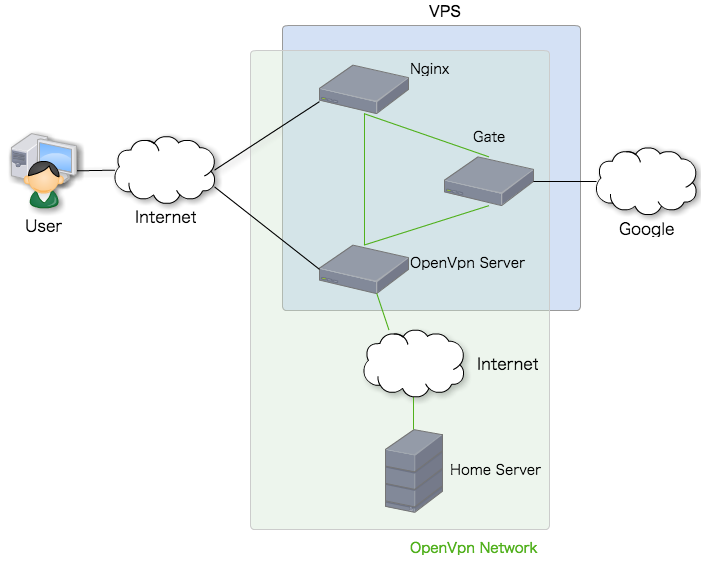

title: AnsibleとPackerでDockerの自動セットアップと我が家の活用例
author:
  name: m-nagai
  url: http://quartet-communications.com
style: style.css
output: slide.html
controls: true

--

# たつきち~~(さん)~~に Dockerを教える会
 
## 20150911 @kuartet-communications

--

# AnsibleとPackerで Dockerをセットアップする ＆ 我が家の活用例

--

### 本日のメニュー

* Docker
* Packer
* Ansible
* 活用事例

--

# Docker

--

### Docker

# "Dockerコンテナは バイナリである"

--

# 以上。
## 細かい説明は他の人にお任せます

--

# Packer

--

### Packer

- 仮想マシンのイメージを色々作ってくれるツール
- 設定ファイルはJSON形式
    - Builder
    - Provisoner
    - Post Processor

--

### Packer:Builder

- イメージ自体を作成してくれる奴
- 対応している主なイメージ
    - Amazon EC2 (AMI)
    - DigialOcean
    - Docker
    - Google Compute Engine
    - QEMU
    - VirtualBox
    - VMWare

## ※他にもいくつかあります

--

### Packer:Provisoner

- イメージの中身を構築してくれる奴
- いろんなツールが使える
    - Shell
    - Ansible
    - Chef
    - Puppet
    - Salt

## ※他にもいくつかあります

--

### Provisoning Tools

- 過去の遺産を流用できるか
- 冪等性が必要かどうか
  - Immutable Infrastructure
- サーバ構築の際のポリシー
  - Python or Ruby or Shell?

--

### Ansible By Packer

- ansible-local
  - イメージ内にAnsibleをインストール
  - イメージ内にPlayBooksをコピー
  - Ansibleの実行！
- ansible-localを実行させる前にAnsibleが動くようにセットアップしてあげないといけない
- 余分なものがインストールされないAnsibleの良さが無くなっているが、今後に期待

--

### Installing Docker By Ansible

- 色々パッケージをインストール
    - Docker
    - Docker-Compose
    - Packer
    - Supervisor
- Packerを使ってDockerイメージを作成＆インポート
- Supervisor越しにDocker-Composeを使ってDockerを立ち上げ

## これでサーバを再起動しても自動でDockerが立ち上がります

--

### 活用事例

- さくらVPS上に構築
- Dockerイメージはどこにもホスティングしていない（経済的な理由）
- Dockerで動かしているのは以下のサーバ
  - Nginx
  - OpenVPN
  - Gate
- ストレージ用のコンテナは用意していない
- ログ等も外出ししていない

--

### 構成図

--

# 終わり
